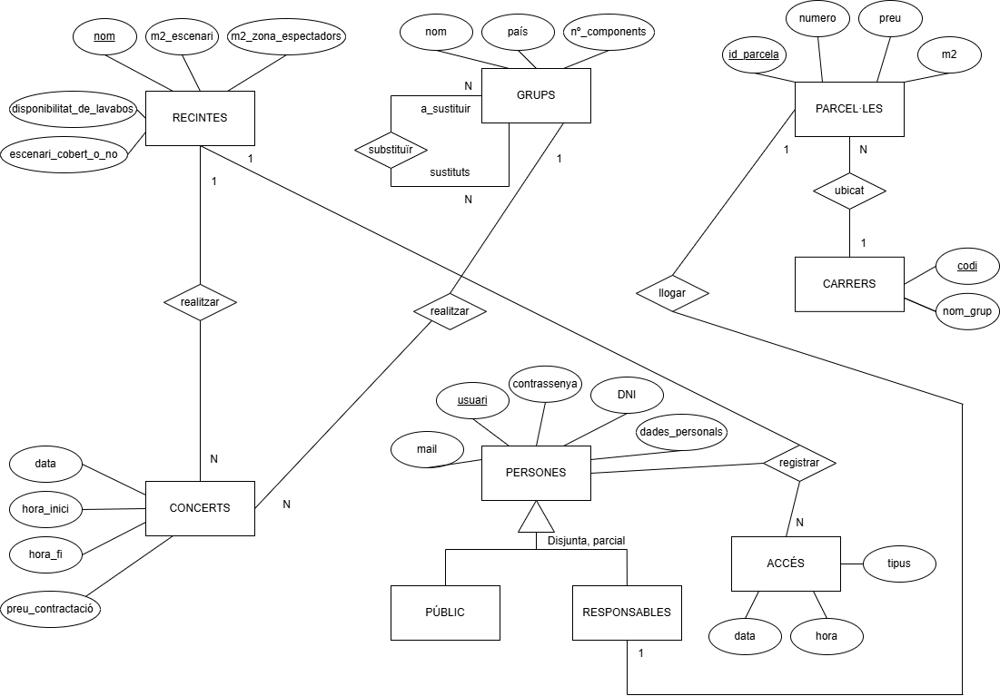

# Disseny-DDBB

Per aquesta pràctica hem hagut de dissenyar una base de dades de model d'entitat-relació sobre l'enunciat de la pràctica.

Així és com ens ha quedat el resultat final:

A partir de l'enunciat, hem fet les següents entitats (on cadascuna té els seus atributs):
1) RECINTES
2) CONCERTS
3) GRUPS
4) PARCEL·LES
5) CARRERS
6) PERSONES (amb dos subentitats: PÚBLIC i RESPONSABLES)
7) ACCÉS

Aspectes a destacar
-------------------

- RECINTES té com a clau primària el nom, ja que el recinte és identificat pel seu nom.
- RECINTES té una relació 1 - N amb CONCERTS, ja que en un recinte es poden fer diversos concerts.
- GRUPS té una relació 1 - N amb CONCERTS, ja que un grup pot realitzar diversos concerts.
- A dintre de GRUPS, hi ha una relació recíproca N - N, perquè un grup pot substituïr a un altre grup.
- A PARCEL·LES, id_parcela és un atribut que hem afegit com a clau primària per identificar la parcel·la.
- PARCEL·LES té una relació N - 1 amb CARRERS, ja que diferents parcel·les poden estar ubicades en un mateix carrer.
- PARCEL·LES té una relació 1 - 1 amb RESPONSABLES (subentitat de PERSONES), ja que un responsable lloga una parcel·la.
- CARRERS té com a clau primària el codi, ja que un carrer és identificat pel seu codi.
- PERSONES té com a clau primària usuari, perquè és l'usuari qui identifica a la persona.
- PERSONES té dos subentitats: PÚBLIC i RESPONSABLES, on públic és els espectadors que hi van al concert i responsables qui lloguen la parcel·la. I és disjunta i parcial, disjunta perquè només poden tenir una especialització, i parcial perquè no hi són tots els tipus de persones que hi poden haver.
- ACCÉS té una relació N - 1 amb RECINTES, perquè hi poden haver molts registres en un recinte.